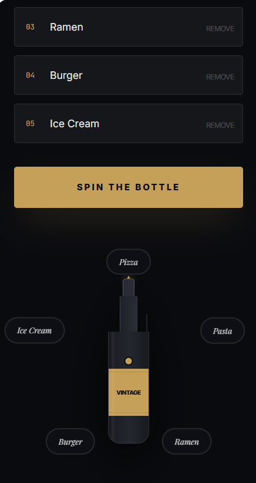

# Vintner's Spin

An elegant, high-fidelity decision-making application featuring a realistic bottle-spinning mechanic with physics-based animations.



## Features

- **Realistic Physics**: Smooth, high-performance animations powered by `framer-motion`.
- **Dynamic Options**: Add up to 5 custom "stakes" or outcomes that arrange themselves perfectly around the rotation circle.
- **Precision Selection**: A custom-designed bottle component with an integrated precision pointer for unambiguous results.
- **Premium Design**: A dark, sophisticated theme utilizing Tailwind CSS and carefully selected typography (serif italics and monospace accents).
- **Responsive Layout**: Designed for seamless use on both desktop and mobile devices.

## Tech Stack

- **Framework**: React 18
- **Build Tool**: Vite
- **Styling**: Tailwind CSS
- **Animations**: Framer Motion
- **Icons**: Lucide React

## Getting Started

### Prerequisites

- Node.js (v18 or higher)
- npm (or yarn/pnpm)

### Installation

1. Clone the repository:
   ```bash
   git clone [your-repo-link]
   cd vintners-spin
   ```

2. Install dependencies:
   ```bash
   npm install
   ```

3. Start the development server:
   ```bash
   npm run dev
   ```

4. Build for production:
   ```bash
   npm run build
   ```

## Design Philosophy

Vintner's Spin aims to transform a simple "spin the bottle" mechanic into a premium experience. By moving away from generic bright colors and instead using a palette of deep charcoals, gold leaf accents (`#C5A059`), and delicate border-glows, the app feels more like a tool for refined decision-making.

---

Built with precision and style.
